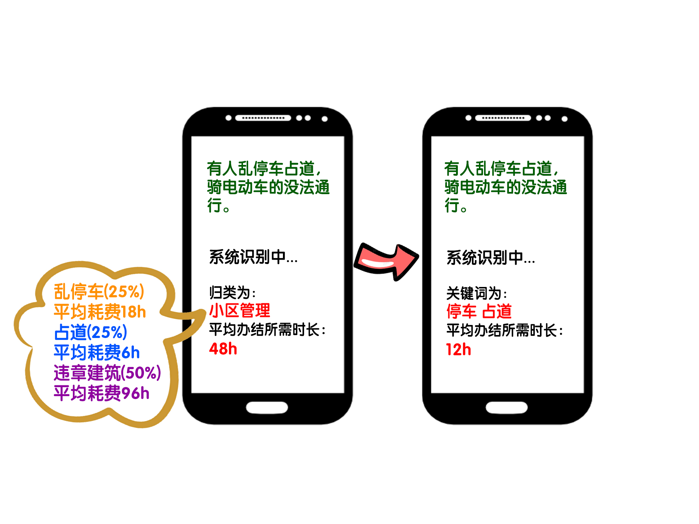

## STAT3060-website
- In STAT3060, we focus on how to use computational thinking and real data to quantitatively solve social science problems. 
- Through Python and its application in data science, we will take the smart community of Fuzhou as an example, discover problems, collect and combine data from end users, enterprises, governments and other parties and propose solutions. 
- This website shows how we improve the residential support function of the wechat public platform called "问需金山".

### Introduction

"你呼我应", the residential support function of "问需金山" mainly provides a platform for residents to make complaints and suggestions to the community more easily. As long as one fills in the form as required, the complaint will be uploaded and sent to relevant staff, then he or she may get the reply in several days.
However, we noticed some problems:
###### for residents
- Residents can only see the recently closed cases. There's no monthly or quarterly summary of cases closed available for residents. 
- Residents don't get a quick idea of how much time each case takes for related department to resolve. 

###### for the company
- Each time a new case is uploaded, the staff member will manually identify the category and which related department it should be transferred to. What we are going to do is to simplify this step: for example, we can abstract some key words from the case descriptions to categorize these cases into some specified groups. In this way, we can better help classify and assign the cases. 

### Our ideas (Method, Result and Discussion)
For the problems mentioned above, our solutions are given below:

##### It should be noted that due to the lack of data provided by Zhongtian Community, we additionally supplement the data recorded by Sanya "12345" citizen support hotline since both Fuzhou and Sanya belong to Second-tier City and they are tourist cities. 

##### 1. Visualization of monthly summary of cases closed 简单放一张月度总结的可视化图
展示完整报告 再简单介绍一下整体情况

##### 2.1. Automatic classification and assignment of cases (facing company)
For this part, we used machine learning to get the work done. Basically our thought is to identify the importance of each word for each text and the probability that the text belongs to each category, to get the final results.

We first divided the whole content into many word blocks. 

Then calculate the TF-IDF value of each block. Here, TF-IDF(Term Frequency-Inverse Document Frequency) is a statistical measure that evaluates how relevant a word is to the content of one case in a collection of cases. This is done by multiplying two metrics: how many times a word appears in one case, and the inverse frequency of the word across a set of contents of cases. 

For more details, please refer to https://monkeylearn.com/blog/what-is-tf-idf/

At next step, MNB(Multinomial Naive Bayes Classifier) plays the critical role. Briefly, with the calculated TF-IDF value, MNB helps us compute the conditional probabilities of occurrence of different events based on the probabilities of occurrence of each individual event. Actually, Naive Bayes classifiers have worked quite well in many real-world situations, famously document classification and spam filtering. They require a small amount of training data to estimate the necessary parameters.

For more details, please refer to https://www.geeksforgeeks.org/naive-bayes-classifiers/

The method is completed, problem comes behind:
放一些图
- When we use Bayes Classifier, if the numbers of training samples of different categories in the classification task vary greatly, i.e., imbalanced datasets, the result will be biased towards large categories. 

                            

                    

  For example, our dataset is imbalanced. If we classify complaint information in “你呼我应” according to the type of incident, we can observe a big difference that "小区管理类" accounts for 63.3% of the total samples, while "消防安全类" only accounts for 2.9%. After calculating the error rate of predicting each category, the error rate of predicting "街面秩序类" is the largest, which is 32.4%. Besides, 81.8% of the wrong predictions are "小区管理类", so this category imbalance has a negative impact on the classification results. (It is worth mentioning that "消防安全类", the category with the smallest percentage, is not the category with the largest error rate, probably because the vocabulary used in the "消防安全类" has great characteristics that clearly distinguish this category from other categories. For future improvement, we can adopt undersampling, oversampling, or changing the model to solve the sample imbalance problem. 放图放图

  For more details, please refer to https://www.cnblogs.com/zhangxianrong/p/15214399.html
  
- TF-IDF is not perfect. It only uses word frequency information as a measurement of the importance of feature items in the data set. This results in the inability to correctly reflect the differences between documents of different categories. As we said above, TF-IDF doesn't work well when it comes to unbalanced data. Therefore, we introduce an improved method, FDCD-TF-IDF, based on word frequency distribution and category distribution, proposed by Haoying Wu and Na Yuan from Wuhan University of Technology. The experimental results show that this improved algorithm can "achieve better classification results on both balanced and unbalanced text data sets" (Wu and Yuan 212).

  FDCD-TF-IDF reflects the correlation between the feature items and the categories, and the category information of the feature items, thus solving the limitations of the original TF-IDF algorithm. The flow chart is given below (Wu and Yuan 213).
  
  
  
  For more details, please refer to https://doi.org/10.1145/3232116.3232152

- MNB Classifier can be improved as well. Eibe Frank from University of Waikato and Remco R. Bouckaert from Xtal Mountain Information Technology proposed an appropriate correction by "adjusting attribute priors" (Frank and R. Bouckaert 503). With this correction implemented as another data normalization step, they showed that "it can significantly improve the area under the ROC curve" (Frank and R. Bouckaert 503).

  For more details, please refer to https://doi.org/10.1007/11871637_49

##### 2.2. Automatic classification and average time of cases (facing residents)

                            

                    

Because we didn't get the data from Zhongtian Community, we used Sanya's data.

With this function, we supposed that once the resident fills in the form as required, he or she can get the average time it took for this type of complaint to be dealt with previously. Getting the average time required, they will have a general idea of how long their complaints will be resolved.

Of course, there's still room for improvement, the current categories are not so clear that can help residents as expected. As the categories might be too broad, containing too many various cases, which becomes confused sometimes: 

So a possible solution is that we can make new specified categories for residents. Using keywords such as "rubbish(垃圾)", "parking(停车)", "cube(管道)", etc, to do the classification might have a better effect. 

### Conclusion
Basically, we proposed three suggestions to the current functions of "你呼我应", two for improving residents' convenience, monthly summary of cases closed and quick access to the average time required for each type of case; one for increasing the work efficiency of community workers, automatic classification and assignment of cases. All three still have a lot to improve, but we hope that currently these three functions can really help a bit.

### Works Cited
1. Frank, Eibe, and Remco R. Bouckaert. "Naive bayes for text classification with unbalanced classes." European Conference on Principles of Data Mining and Knowledge Discovery. Springer, Berlin, Heidelberg, 2006.
2. Wu, Haoying, and Na Yuan. "An Improved TF-IDF algorithm based on word frequency distribution information and category distribution information." Proceedings of the 3rd International Conference on Intelligent Information Processing. 2018.

